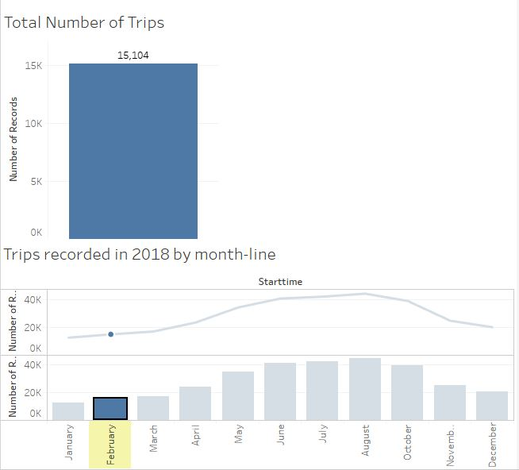

# Tableau - Citi Bike Analytics

[Citi-Bikes - Tableau site](https://public.tableau.com/profile/funke.olaleye#!/vizhome/citibike_tripdata/CitibikeTripdata)

## Background

In this work, I generated regular [reports](https://public.tableau.com/profile/funke.olaleye#!/vizhome/citibike_tripdata/CitibikeTripdata) for city officials to publicize and improve the city program [New York Citi Bike](https://en.wikipedia.org/wiki/Citi_Bike).

Since 2013, the Citi Bike Program has implemented a robust infrastructure for collecting data on the program's utilization. Through the team's efforts, each month bike data is collected, organized, and made public on the [Citi Bike Data](https://www.citibikenyc.com/system-data) webpage.

However, while the data has been regularly updated, the team has yet to implement a dashboard or sophisticated reporting process. City officials have a number of questions on the program, so the task is to build a set of data reports to provide the answers.

## Task

* Aggregate the data found in the Citi Bike Trip History Logs for year 2018 and find two unexpected phenomena. 

* Design visualizations for each discovered phenomena. 

* How many trips have been recorded total during year 2018?

* What are the peak hours in which bikes are used during summer months?

* What are the peak hours in which bikes are used during winter months?

[Peak_hours_summer_and_winter](Resources/Peak_hours_summer_and_winter.JPG)

* What are the top 10 stations in the city for starting a journey? (Based on data, why do you hypothesize these are the top locations?)

* What are the top 10 stations in the city for ending a journey? (Based on data, why?)

[Top_10_Start_and_End_Stations](Resources/Top_10_Start_and_End_Stations.JPG)

* What is the gender breakdown of active participants (Male v. Female)?

[Gender_Distribution_Riders](Resources/Gender_Distribution_Riders.JPG)

* What is the trip duration by Age?

[Trip_Duration_By_Year_and_Age](Resources/Trip_Duration_By_Year_and_Age.JPG)

* Which bikes (by ID) are most likely due for repair or inspection in the timespan?

[Bike_Location](Resources/Bike_Location.JPG)

* How variable is the utilization by bike ID?

[Bike_Utilization](Resources/Bike_Utilization.JPG)

Next,

* Use the visualizations to design a dashboard for each phenomena.
* The dashboards accompanied with an analysis explaining why the phenomena may be occuring. 

* A static map that plots all bike stations with a visual indication of the most popular locations to start and end a journey with zip code data overlaid on top.

Finally, create final presentation

* Create a Tableau story that brings together the visualizations, requested maps, and dashboards.

[Citi-Bikes - View the Tableau story](https://public.tableau.com/profile/funke.olaleye#!/vizhome/citibike_tripdata/CitibikeTripdata)

### Funke Olaleye Data Analytics and Data Science

